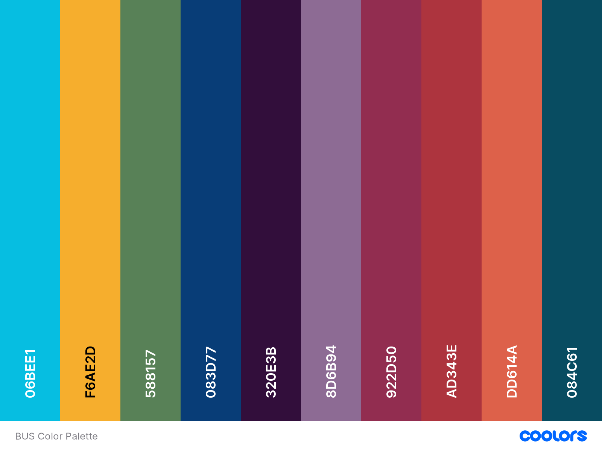

# Contributing

## Style Guide

See also: https://github.com/aensley/bus-assets

### Logo Font

- [Sue Ellen Francisco](https://fonts.google.com/specimen/Sue+Ellen+Francisco#standard-styles)

### Color Palette

- **`#06bee1`** 
- **`#f6ae2d`** 
- **`#588157`** 
- **`#083d77`** 
- **`#320e3b`** 
- **`#8d6b94`** 
- **`#922d50`** 
- **`#ad343e`** 
- **`#dd614a`** 
- **`#084c61`** 

[**Full Color Palette**](https://coolors.co/06bee1-f6ae2d-588157-083d77-320e3b-8d6b94-922d50-ad343e-dd614a-084c61)

